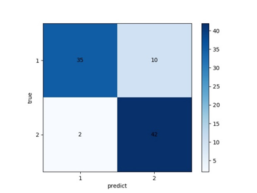

# Aneurysm-rupture-prediction

In the hemodynamic-based cerebral aneurysm rupture prediction algorithm, the problem of uneven data distribution is first solved by using the preferred clinical data. Through the integration and screening of clinical data, it is found that the data distribution is not balanced, and a balanced distribution data set is extracted based on the original data. Data with large distribution differences are eliminated to ensure the universality of the model input data. In the support vector machine model training, each data input is a multidimensional vector containing patient gender, age, blood pressure, ischemic stroke, aneurysm size, location, average wall shear stress, blood flow aggregation, blood flow impact area, blood flow stability, etc., to obtain the ROC curve and confusion matrix of the model.
